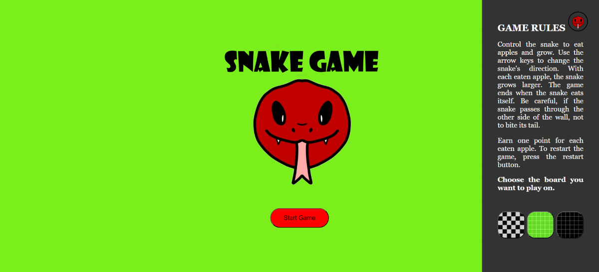
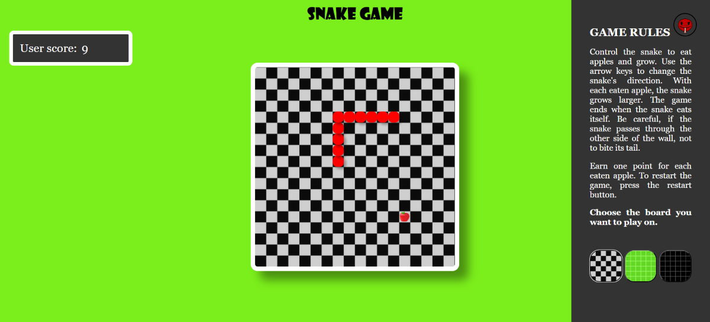

## Project Report: Snake game

# 1. Introduction
Version of a Classic Snake Game:
This is a version of the classic Snake game where the player controls the snake to eat apples. As the snake eats apples, it grows longer. The snake can pass through walls but will lose if it collides with its own body.

Skills Developed:
The development of this game helped improve my understanding of grid-based systems, implementing key commands for user input, adding and tracking the score, and working with arrays for storing the snake’s body positions.

# 2. Project Overview
Objective:
The objective of this project is to recreate the classic Snake game where the player controls the snake to eat apples, causing it to grow longer. The challenge lies in avoiding collisions with the snake’s own body while trying to achieve the highest score possible.

Key Features:

Player Controls: The player uses arrow keys (or WASD) to control the snake’s direction.

Increasing Difficulty: The snake grows longer as it eats apples, making it more difficult to avoid its own tail.

Score System: The game keeps track of the score based on how many apples the snake eats. The more apples consumed, the longer the snake and the higher the score.

Game Over Condition: The game ends when the snake collides with its own body.

Customizable Background: Players can change the background of the grid during gameplay to make the visuals more engaging.

# 3. Screenshots
- Main Menu:
  
 
- Gameplay:
  

